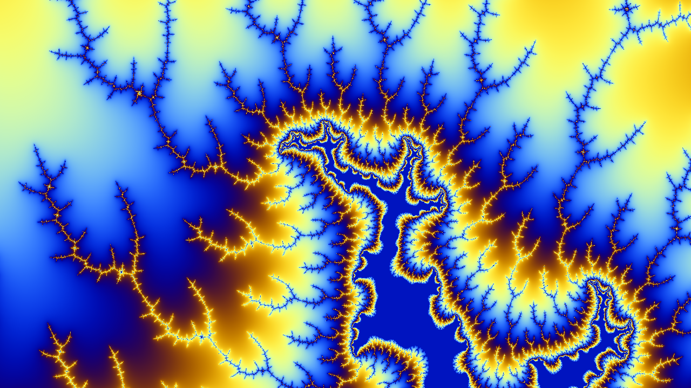
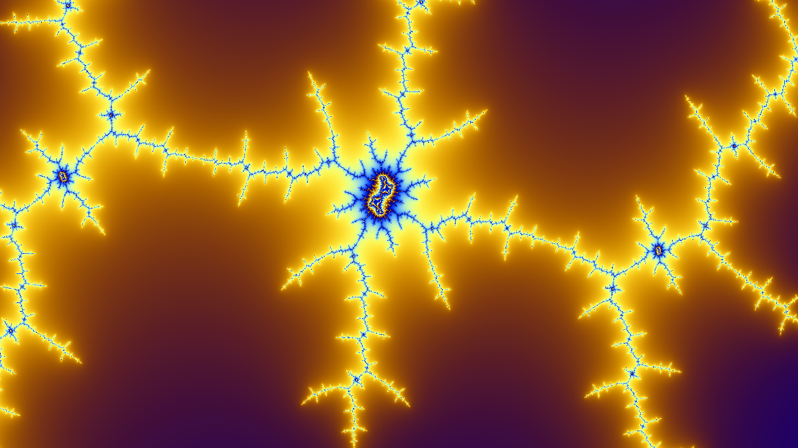
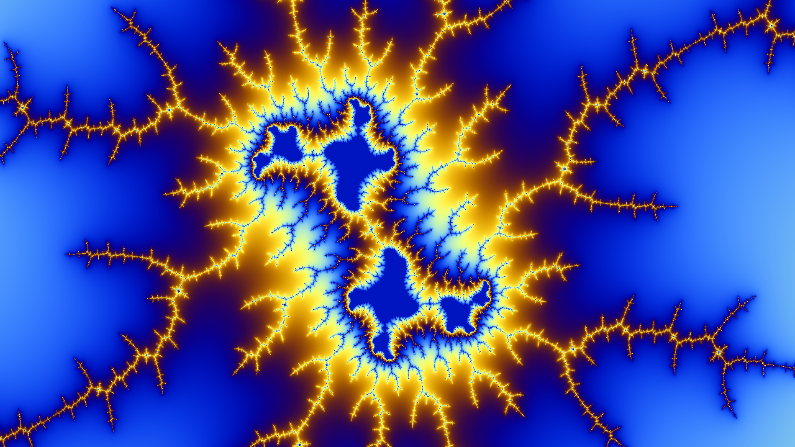

# Fractal Explorer

An Escape-Time Fractal Explorer written in Python for Mandelbrot and Julia Sets.

Exploring works in real time for moderately sized windows (e.g. 640x360) by using Just-In-Time Compilation (JIT) and SIMD instructions provided by `numba`.

Run `viewer.py` to explore the fractals!






# Keys and Mouse Controls

Key | Function
--- | ---
Mouse Drag | Pan around the fractal
Mouse Scroll | Zoom in and out
`m` | Switch to Mandelbrot Set
`j` | Switch to Julia Set
`s` | Toggle smooth coloring
`i` | Increase the number of iterations
`Shift+i` | Decrease the number of iterations
`k` | Increase the Julia Set real constant
`Shift+k` | Decrease the Julia Set real constant
`l` | Increase the Julia Set imaginary constant
`Shift+l` | Decrease the Julia Set imaginary constant
`c` | Capture current fractal and save as an image


# Dependencies

* `numpy`
* `numba`
* `pillow`
* `imageio`

```
pip install numpy numba pillow imageio
```

# Acknowledgements

* Wikipedia pages on the [Mandelbrot Set](https://en.wikipedia.org/wiki/Mandelbrot_set), [Julia Set](https://en.wikipedia.org/wiki/Julia_set) and [Smooth Coloring](https://en.wikipedia.org/wiki/Plotting_algorithms_for_the_Mandelbrot_set).
* javidx9's [video on Fractals](https://www.youtube.com/watch?v=PBvLs88hvJ8) and on [Panning and Zooming](https://www.youtube.com/watch?v=ZQ8qtAizis4).